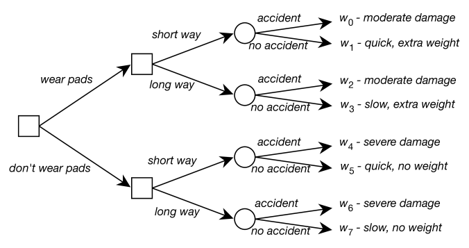
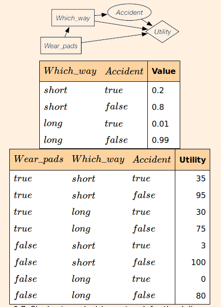

# activity 13: Planning in AI, due April 15th, 2020 by midnight

## Summary

Planning is explicit deliberation process that chooses and organizes actions by anticipating their outcomes.
It is one of traditional, long-standing sub-area of AI. In planning the task is to find a procedural course of action
for a declaratively described system that allows it to reach its goals while optimizing overall performance measures.
In comparison to the classification, planning provides guarantees on the solution quality. There are many applications
that use planning including robots and autonomous systems, cognitive assistants, cyber security, etc.
Some examples of existing AI planning agents include GO player AlphaGO and cognitive assistant Viv.
Planning solutions are favored for problems where there exists domain knowledge that can be used for building a model,
when the structure of the problem makes learning from training data difficult, when there is no large training data
available, or when the problem changes make previous data irrelevant.

The following is based on [Section 9.2 in the FCA book](https://artint.info/2e/html/ArtInt2e.Ch9.S2.html) and it is
strongly recommended that you read that section to gain a better understanding of the concepts.

Simplest AI planning problem is characterized by the restriction to one agent in a deterministic environment that can be fully observed.
More complex forms of planning involve some uncertainty about the effects of actions. With uncertainty, an agent typically cannot
guarantee to satisfy its goals, and thus solutions must take into account planning, reacting, observing, succeeding and failing simultaneously.
This involves decision making.
*Decision trees* can represent agent's choices and the outcomes of these choices.
Consider the problem of the delivery robot that has to travel from one position to another position, where there is a chance that the robot will slip off course and fall down the stairs.
The robot can get pads that will not change the probability of an accident but will make an accident less severe. However, the pads add extra weight.
The robot can go the long way around, reducing the probability of an accident but make the trip much slower.
Thus, the robot has to decide whether to wear the pads and which way to go (the long way or the short way).
The uncertainty is whether there is an accident. For each combination of the agent?s choices and whether there is an accident,
there is an outcome ranging from severe damage to arriving quickly without the extra weight of the pads.
Figure below depicts a decision tree for this delivery robot. Square boxes represent decisions that the robot can make.
Circles represent random variables that the robot cannot observe
before making its decision.

Agent can make a one-off decision or it can make sequential decisions.  
In one-off decision making, a decision variable is used to model an agent's choice.
A decision variable is like a random variable, but it does not have an associated probability distribution.
A single-stage *decision network* consists of:

- Decision nodes (rectangles) represent decision variables. The agent
gets to choose a value for each decision variable.

- Chance nodes (ovals) represent random variables. Each chance node
has an associated domain and a conditional probability of the
variable, given its parents.

- A utility node (diamond) represents the utility. The parents of the
utility node are the variables on which the utility depends.

Once a decision network is constructed, a policy can then be created, which is an assignment of a
value to each decision variable.

A single-stage decision network for the delivery robot is shown below:

Sequential decision making and decision networks for indefinite horizon problems involve
more complex solutions and are not covered in this activity but can be read about in
section 9.3-9.5 in FCA book.

## Tasks

1. Read the Summary above.

2. Create a decision tree and a decision network (similar to images above) for a simple problem of your choosing.
You can select the values and utilities.
You may either draw these by hand and take a picture of it or draw them in a graphing software of your choice or integrate them directly into Markdown. These graphics must be incorporated into the reflection document (for example, as images).

3. Write a reflection on this activity in the `writing/reflection.md` following the prompts given in the reflection document template.

### Deliverables

- `reflection.md` file with answers to the prompted questions and the decision tree and decision network graphics.
