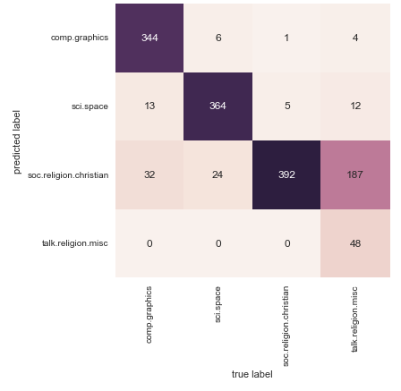

# CMPSC 310 Exam 1 Information and Practice
# Name:

## Exam Information
The first exam will be held during the class session on Monday, March 2 at 11:00 am.
The exam will be available via GitHub Classroom and must be submitted through each student's `exam1` repository.
The exam will be open book and notes, including your class notes, my class notes and hand outs, but you can not use anything that has been printed from the Web or access anything through the Web during the exam, other than the course Website and the course GitHub repositories.

This exam may include questions on the material covered since the beginning of the semester through February 26. The slides should be a good study guide for the material that you are responsible for. In the addition to the content covered on the slides, you should also be comfortable using the tools and programs explored in class and labs 1-2.

## Exam Format
The exam will consist of ten questions consisting of a mixture of the following types of questions:
* Multiple choice
* Short answer (provide 2-3 sentence explanation and give an example)
* Problem solving (given a stated problem, find a solution)
* Output analysis (given an output of a program, explain its meaning)

## Material (aka Things to Know)
* What is AI? Connections to other disciplines and philosophical implications behind AI.
* What is an agent? A rational agent?
* Different types of agents.
* Types of environments.
* PEAS.
* Overview of Computer Vision.
* OpenCV: basic image operations.
* Learning Overview.
* Classification problem: SVM, Decision Trees, Random Forests. 
* General understanding of cascades.
* Object/face detection/recognition.
* Probability terminology and basic probability problems.
* Bayes Rule and Naive Bayes algorithm.

## Note: The remainder of this document contains practice questions for the first exam. It does not represent questions over all concepts that maybe covered during the exam. You are responsible for all material covered in class so far.

### Question 1 (put X inside the appropriate brackets)

A reflex agent is an agent that:
- [ ] Builds a model of the environment and uses it to map percepts to actions
- [ ] Builds a model of the environment and uses it to reach a desirable state towards the goal
- [ ] Simply maps percepts to actions
- [ ] Builds a model of the environment and adapts it through learning

### Question 2

RoboCup is an annual international robotics competition that aims to promote robotics and AI research by offering a publicly appealing, but formidable challenge.

1. Consider a task of designing autonomous soccer playing robot. Specify the PEAS description of this task environment.

2. Classify the task environment of this robot (e.g., observable, multi-agent, stochastic, sequential, dynamic, discrete). State any assumptions you are making.

### Question 3

Based on the class discussions, readings and your preliminary understanding of "intelligence", provide one argument with justification (1-2 sentences) for and one argument against the following statement: "Intelligent machines can be ethical".

### Question 4

When an alligator is hungry, the probability that it will eat is 0.9 (why not 1? it depends on the food - alligators don't care for, e.g., warmed-over tuna casserole). On the other hand, if the gator is not hungry, there is still a 0.3 probability that it will eat (some foods are irresistible - gators are particularly fond of hot fudge sundaes). At any given time there is a 50% chance that an alligator will be hungry. Final numerical answer is not required, show the steps is sufficient.

1. What is a sample space for this problem?

2. What is the probability of gator being not hungry?

3. You have just observed a gator eating lunch (it devoured a Big Mac and some fries). What is the probability that it was hungry before it ate?

### Question 5

Describe a sequence of computer vision functions one may utilize on images before applying some "intelligent" task (e.g., learning) on them. You must describe at least two functions. Provide explanation of and justification for the need of each one.

### Question 6

Consider the problem faced by a person learning to play tennis (or some other sport that you are familiar with). Explain how this process fits into the learning model. Describe the percepts and actions of the person, and the types of learning the person must do. What type of learning is it (supervised, unsupervised, reinforcement)?

### Question 7

Assume we are using `hog.detectMultiScale` function of OpenCV.

1. What is `hog`? How is it used in computer vision learning?

2. One of the parameters of the `detectMultiScale` function is `winStride`. What does this parameter represent? Comment on the effect of the value of this parameter on the performance of the learning task.

### Question 8

Identify *two* model performance metrics in the `metrics` subpackage in scikit-learn. Explain what each of these metrics is evaluating.

### Question 9

In 5-fold cross validation, what does the number 5 represent?

### Question 10

What can you tell about the performance of Naive Bayes Classifier from the image below?

